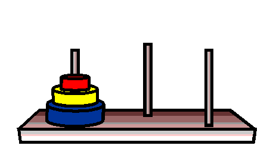

🚀 Exercício 1: Crie um algoritmo não recursivo para contar quantos números pares existem em uma sequência numérica (1 a n).  
🚀 Exercício 2: Transforme o algoritmo criado acima em recursivo.  
🚀 Exercício 3: Crie um algoritmo recursivo que encontre, em uma lista, o maior número inteiro.  
🚀 Exercício 4: Escreva um algoritmo recursivo para encontrar o máximo divisor comum (mdc) de dois inteiros.  
Exercício 5: Escreva um algoritmo recursivo que identifica se um número é primo.  
Exercício 6: Escreva um algoritmo que recebe uma lista e retorne-a na ordem reversa.  

### Bônus

Exercício 7: Escreva um algoritmo recursivo que resolva o problema da torre de hanoi, seguindo as instruções:  

- Assim como na imagem abaixo, a torre deve conter 3 discos, e três colunas;
- Os discos começam alinhados na primeira coluna, e devem ser organizados respeitando a ordem de tamanho, na última coluna.

